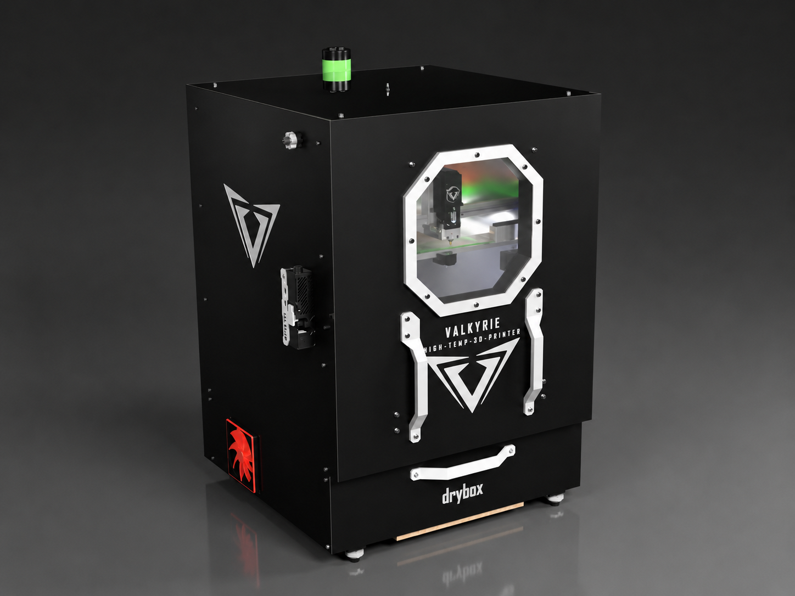

# Valkyrie V2

Source-available, non-commercial DIY high-temperature CoreXY FFF platform.

Valkyrie V2 is a complete redesign of the Valkyrie high-temperature printer platform. The design focuses on structural rigidity, high-temperature operation, serviceability, thermal separation, and automated calibration.

The standard electrical configuration is 220-240 VAC. A 110-120 VAC configuration is possible only with configuration-specific heaters, power supplies, switching devices, wiring, connectors, and circuit protection.

## Project status

This repository represents the initial public V2 release. Verified prototype results are separated from design targets throughout the documentation. Materials and operating conditions that have not yet been validated are identified accordingly.

## Fusion 360 CAD Model

Explore the complete Valkyrie V2 assembly directly in Autodesk Fusion:

**➡️ [Open the Valkyrie V2 Fusion 360 Model](https://a360.co/4qquDOy)**

The online model includes the latest public design and allows you to inspect the complete assembly and individual components directly in your browser or Fusion 360.

## Main specifications

| System | Specification |
| --- | --- |
| Architecture | CoreXY |
| Build volume | 330 × 300 × 280 mm |
| Bed plate | 350 × 350 × 8 mm cast aluminium 5083 |
| Build sheet | 330 × 330 mm removable build sheet |
| XY motion | External dual-motor CoreXY with all-metal MGN12 linear rails |
| Z motion | Three independently driven belt-lift Z axes |
| XY motors | 2 × NEMA 17, 48 mm, 55 N·cm, 2.5 A, long-shaft |
| Z motors | 3 × NEMA 17, 40 mm, 45 N·cm, 2 A |
| Extruder | BTT V2X, 7:1 gearing, 73.5 N (7.5 kgf) rated extrusion force |
| Hotend | Custom water-cooled Valkyrie high-temperature hotend |
| Maximum nozzle temperature | Up to 500 °C |
| Maximum build-plate temperature | Up to 150 °C |
| Active chamber | 100 °C verified, 120 °C target |
| Chamber heater | 750 W PTC heater, configured as RRF Chamber 1 |
| Drybox heater | 300 W PTC heater, configured as RRF Chamber 2 |
| Controller | Duet 3 6HC |
| Firmware | RepRapFirmware with Duet Web Control |
| Standard input | 220-240 VAC |
| Optional input | 110-120 VAC with configuration-specific components |

## Verified performance and targets

| Performance | Verified | Target |
| --- | ---: | ---: |
| Maximum print speed | 200 mm/s | 500 mm/s |
| Maximum acceleration | 10,000 mm/s² | 20,000 mm/s² |
| Maximum volumetric flow rate | 20 mm³/s | 30 mm³/s |
| Maximum travel speed | 500 mm/s | 1,000 mm/s |
| Chamber heat-up | 30 min to 100 °C from 25 °C ambient | 30 min or less to 100 °C |
| Drybox temperature | Up to 80 °C | Up to 80 °C |

Performance depends on material, nozzle, toolhead configuration, cooling, firmware settings, and operating temperature. Target values are development goals rather than guaranteed operating specifications.

## Design overview

### Frame and enclosure

- Aluminium extrusion frame assembled with M6 blind joints.
- Relocated upper rear extrusion for improved chamber sealing, panel installation, cable routing, and service access.
- Additional centre-rear Z extrusion for stiffness and support.
- Vertically lifting overhead door that does not require outward swing clearance.
- Reinforced door brackets with 625ZZ bearings, shoulder bolts, and linked side mechanisms.
- Primary electronics, motors, radiator, pump, and part-cooling blower positioned outside the heated chamber where practical.

### Motion system

- External 2.5 A CoreXY motors with long shafts and upper shaft supports.
- 16T GT2 drive pulleys for increased torque and nominal motion resolution.
- F606ZZ flanged CoreXY idlers.
- High-temperature all-metal MGN12 linear rails.
- Three independent belt-driven Z axes with 5:1 reduction and automatic Z alignment.

### Build platform and calibration

- Cast aluminium 5083 bed plate.
- Three-point Maxwell kinematic mounting system using 10 mm bearing balls.
- Integrated SmCo magnets and locating pins for repeatable build-sheet positioning.
- Bed-mounted nozzle and Z-offset reference sensor.
- Automatic three-point Z alignment, mesh-bed compensation, nozzle-height measurement, and nozzle brushing.

### Toolhead and thermal management

- Water-cooled BTT V2X extruder motor and custom Valkyrie hotend.
- Closed-loop cooling system using a P67D pump, reservoir, and external 120 mm radiator.
- 750 W PTC chamber heater with a 120 CFM recirculation fan.
- Heated bed provides a secondary chamber heat source.
- Independent thermal switch and firmware-configured heater protection.
- External ROBO blower recirculates heated chamber air for part cooling through a CPAP hose and toolhead duct.

### Material management

- Integrated heated filament drybox operating up to 80 °C.
- RepRapFirmware controls the drybox heater as Chamber 2.
- ESP32 monitoring of the DHT22 temperature/humidity sensor and filament load cell.
- Desiccant container and 625ZZ-bearing filament carousel.
- External filament buffer supporting automatic filament loading and unloading.

### Electronics and firmware

- Duet 3 6HC using all six onboard stepper-driver channels.
- Primary 24 V, 350 W power supply and secondary 12 V power supply.
- TS35 DIN-rail mains and 12 V distribution.
- Three solid-state relays for the bed, chamber, and drybox heaters.
- RepRapFirmware and Duet Web Control.
- Input shaping, pressure advance, automatic Z alignment, mesh compensation, thermal monitoring, and configurable print-start and print-end sequences.

## Material validation

Validated on the current prototype:

- PLA
- PETG
- ABS
- ASA
- PA and PA-CF
- PC, PC-CF, and PC blend CF
- PPS, PPS-CF, and PPS-GF

Still to be verified:

- PSU
- PPSU
- PEI (Ultem)
- PEKK

## Documentation

- [Valkyrie V2 Technical Overview v1.0](docs/Valkyrie_V2_Technical_Overview_v1.0.pdf)
- [Valkyrie V2 initial release notes](RELEASE_NOTES.md)

The technical overview describes the machine architecture and prototype configuration. It is not an assembly manual or electrical wiring guide.

## Support

For build assistance, troubleshooting, and questions about Valkyrie V2, please join the official Project Valkyrie Discord server:

[**Get support on Discord**](https://discord.gg/mWARcpt7NQ)

## Safety

Valkyrie V2 uses mains-voltage heaters, high current, high temperatures, moving machinery, and liquid cooling. Mains-voltage components, wiring, connectors, protective earth, fusing, insulation, and clearances must be selected and installed for the configured input voltage by a qualified person in accordance with applicable regulations and manufacturer ratings.

Do not use the project documentation as a substitute for electrical design verification, risk assessment, or compliance testing.

## Credits

### Project lead

**Roy Berntsen** - Project lead, primary mechanical designer, and system integrator.

### Contributors

- **Mark Bridgewater** - Design, electronics, firmware, testing, and documentation.
- **Chris Lombardi** - ESP32 firmware.

### Acknowledgements

- RepRapFirmware
- Duet Web Control
- Duet3D

## Licensing

Valkyrie V2 copyright 2026 Roy Berntsen and contributors.

Unless otherwise stated, the documentation and original project media are licensed under [CC BY-NC 4.0](https://creativecommons.org/licenses/by-nc/4.0/). Hardware design files and software/firmware are subject to the licence notices distributed with those files. Third-party materials remain subject to their respective licences.
